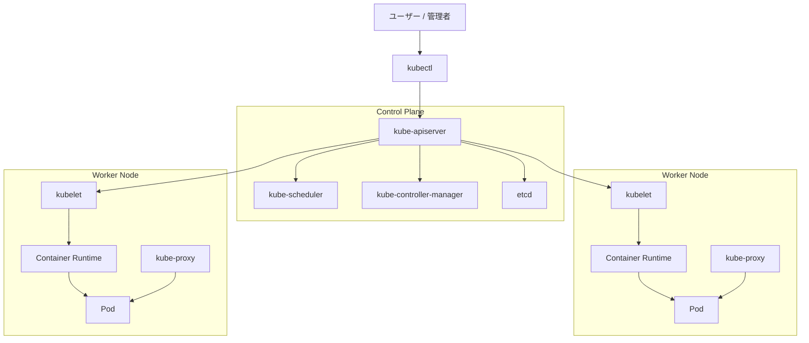
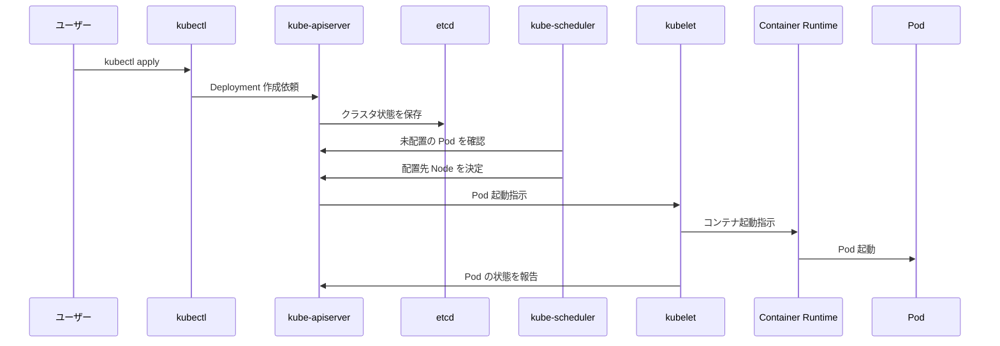

# Kubernetes の Control Plane と Worker Node

Kubernetes クラスタは、大きく分けて次の2種類のノードで構成されます。

* `Control Plane`

  クラスタ全体を管理する役割を持つノードです。

* `Worker Node`

  実際にアプリケーションのコンテナを動かす役割を持つノードです。

---

## 全体像



---

## Control Plane とは

`Control Plane` は、Kubernetes クラスタ全体を管理する部分です。

たとえば、次のようなことを行います。

* `Pod` をどの `Worker Node` に配置するか決める
* `Deployment` の `replicas` 数を維持する
* `Node` や `Pod` の状態を監視する
* クラスタの設定や状態を保存する
* `kubectl` からの操作を受け付ける

つまり、`Control Plane` は Kubernetes クラスタの「司令塔」のような役割です。

---

## Worker Node とは

`Worker Node` は、実際にアプリケーションを動かすノードです。

`Pod` は基本的に `Worker Node` 上で起動します。

たとえば、次のようなものが `Worker Node` 上で動きます。

* `Pod`
* `Container`
* `kubelet`
* `kube-proxy`
* `Container Runtime`

つまり、`Worker Node` は Kubernetes クラスタの「実行部隊」のような役割です。

---

## Control Plane の主なコンポーネント

### kube-apiserver

`kube-apiserver` は、Kubernetes の操作を受け付ける窓口です。

`kubectl` で実行したコマンドは、基本的に `kube-apiserver` に送られます。

例：

```bash
kubectl apply --filename deployment.yaml
```

このコマンドを実行すると、`kubectl` は `kube-apiserver` に対して「この `Deployment` を作成してください」と依頼します。

`kube-apiserver` は、Kubernetes クラスタの入口となる重要なコンポーネントです。

---

### etcd

`etcd` は、Kubernetes クラスタの状態を保存するデータベースです。

たとえば、次のような情報が保存されます。

* `Pod` の情報
* `Deployment` の情報
* `Service` の情報
* `ConfigMap` の情報
* `Secret` の情報
* `Node` の情報

Kubernetes は、現在のクラスタの状態を `etcd` に保存しています。

そのため、`etcd` は非常に重要なコンポーネントです。

---

### kube-scheduler

`kube-scheduler` は、`Pod` をどの `Worker Node` に配置するかを決めるコンポーネントです。

たとえば、新しい `Pod` が作成されたとき、最初はどの `Node` で動かすか決まっていません。

そこで、`kube-scheduler` が次のような情報を見て、配置先の `Worker Node` を決めます。

* `Node` の空きリソース
* `CPU` や `Memory` の要求量
* `Taint` と `Toleration`
* `Affinity` と `Anti-affinity`
* `NodeSelector`

`kube-scheduler` は、`Pod` の配置先を決める役割です。

---

### kube-controller-manager

`kube-controller-manager` は、クラスタの状態を監視し、理想の状態に近づける役割を持ちます。

Kubernetes では、「こうなっていてほしい」という状態を YAML に書きます。

例：

```yaml
replicas: 3
```

これは、「`Pod` を3つ動かしたい」という意味です。

もし `Pod` が1つ落ちて2つになった場合、`kube-controller-manager` がそれを検知し、新しい `Pod` を作成するように働きます。

つまり、`kube-controller-manager` は「現在の状態」と「理想の状態」の差を埋める役割です。

---

## Worker Node の主なコンポーネント

### kubelet

`kubelet` は、各 `Worker Node` 上で動くエージェントです。

`Control Plane` から指示を受け取り、その `Node` 上で `Pod` を起動・管理します。

たとえば、次のようなことを行います。

* `Pod` の起動
* `Pod` の停止
* `Pod` の状態確認
* `Container Runtime` への指示
* `Control Plane` への状態報告

`kubelet` は、`Worker Node` 上の `Pod` を管理する重要なコンポーネントです。

---

### kube-proxy

`kube-proxy` は、`Service` による通信を実現するためのコンポーネントです。

Kubernetes では、`Pod` は作り直されると `IP Address` が変わることがあります。

そのため、`Pod` に直接アクセスするのではなく、通常は `Service` を使ってアクセスします。

`kube-proxy` は、`Service` 宛ての通信を適切な `Pod` に振り分ける役割を持ちます。

---

### Container Runtime

`Container Runtime` は、実際にコンテナを起動するための仕組みです。

代表的なものには、次のようなものがあります。

* `containerd`
* `CRI-O`
* `Docker Engine`

現在の Kubernetes では、`containerd` がよく使われます。

`kubelet` は、`Container Runtime` に対して「このコンテナを起動してください」と指示します。

---

## Pod が起動するまでの流れ



---

## Control Plane と Worker Node の関係

`Control Plane` と `Worker Node` の関係は、次のように考えるとわかりやすいです。

| 種類 | 役割 | 例えるなら |
|---|---|---|
| `Control Plane` | クラスタ全体を管理する | 司令塔 |
| `Worker Node` | 実際にアプリケーションを動かす | 作業員・実行部隊 |

`Control Plane` は、`Worker Node` に対して直接コンテナを動かすというより、`kube-apiserver` を中心にクラスタの状態を管理します。

各 `Worker Node` の `kubelet` が `Control Plane` と連携し、自分の `Node` 上で `Pod` を起動・管理します。

---

## 具体例

たとえば、次のような `Deployment` を作成したとします。

```yaml
apiVersion: apps/v1
kind: Deployment
metadata:
  name: nginx-deployment
spec:
  replicas: 3
  selector:
    matchLabels:
      app: nginx
  template:
    metadata:
      labels:
        app: nginx
    spec:
      containers:
      - name: nginx
        image: nginx:1.24.0
```

この YAML は、「`nginx` の `Pod` を3つ起動したい」という意味です。

このときの流れは次のようになります。

* `kubectl apply` で YAML を適用する
* `kube-apiserver` がリクエストを受け付ける
* `etcd` に設定内容が保存される
* `kube-controller-manager` が `Pod` を3つ作る必要があると判断する
* `kube-scheduler` がそれぞれの `Pod` をどの `Worker Node` に配置するか決める
* 各 `Worker Node` の `kubelet` が `Pod` を起動する
* `Container Runtime` が実際のコンテナを起動する

---

## まとめ

* `Control Plane` は、Kubernetes クラスタ全体を管理する
* `Worker Node` は、実際に `Pod` や `Container` を動かす
* `kube-apiserver` は、Kubernetes 操作の入口
* `etcd` は、クラスタ状態を保存するデータベース
* `kube-scheduler` は、`Pod` の配置先 `Node` を決める
* `kube-controller-manager` は、理想の状態を維持する
* `kubelet` は、`Worker Node` 上で `Pod` を管理する
* `kube-proxy` は、`Service` の通信を制御する
* `Container Runtime` は、実際にコンテナを起動する

Kubernetes では、`Control Plane` がクラスタを管理し、`Worker Node` が実際のアプリケーションを動かします。
