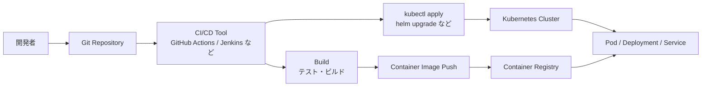
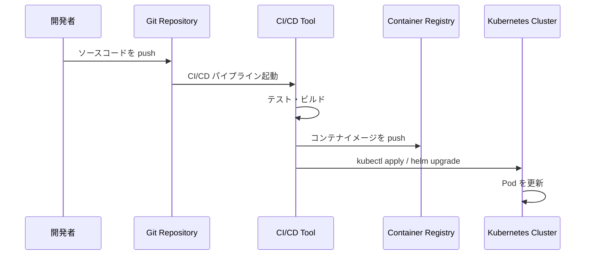
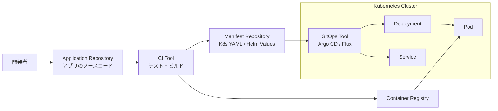
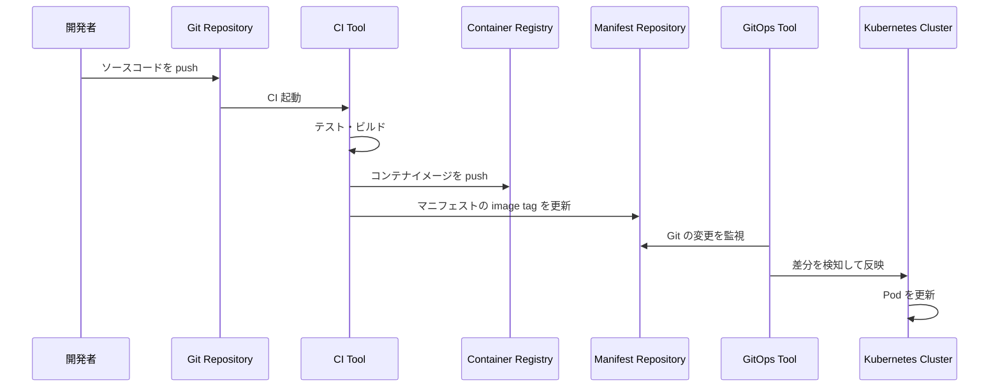
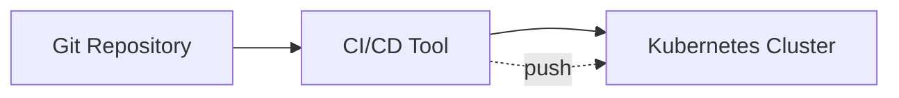
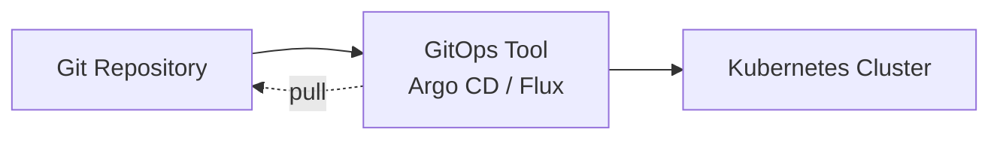
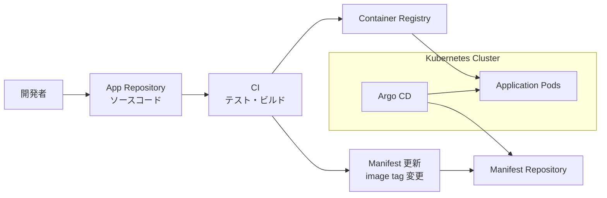
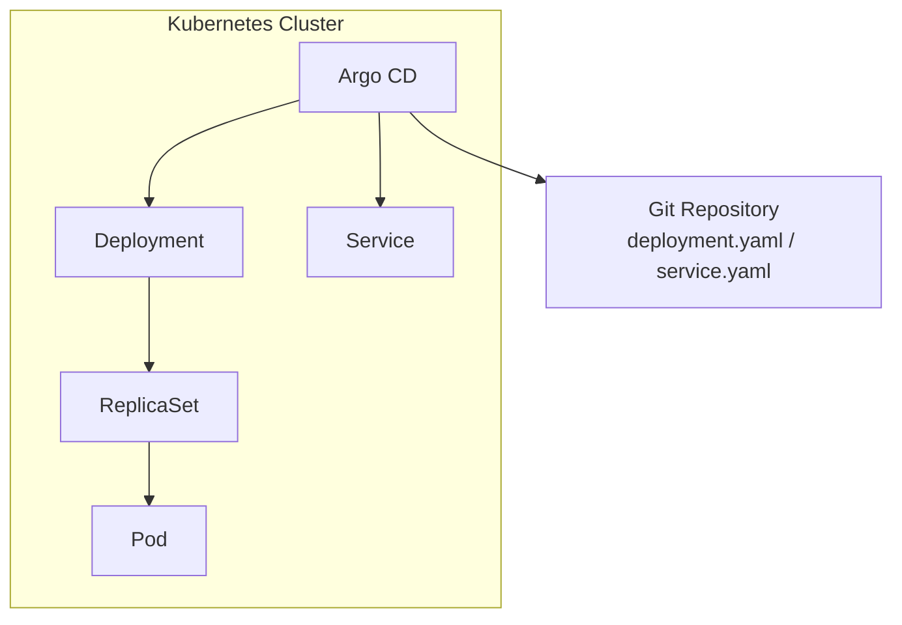

# Kubernetes の CIOps と GitOps

`Kubernetes` へアプリケーションをデプロイする方法には、代表的に次の2つの考え方があります。

* `CIOps`
* `GitOps`

どちらも `Kubernetes` にアプリケーションを反映する方法ですが、**誰が Kubernetes に変更を適用するか** が大きく違います。

---

## ざっくり比較

| 項目 | CIOps | GitOps |
| --- | --- | --- |
| 変更の起点 | CI/CD パイプライン | Git リポジトリ |
| Kubernetes への反映 | CI/CD ツールが `kubectl apply` などを実行する | GitOps ツールが Git を監視して反映する |
| 代表ツール | GitHub Actions, GitLab CI, Jenkins | Argo CD, Flux |
| 考え方 | CI/CD ツールからクラスタへ push | クラスタ側が Git から pull |
| Kubernetes 認証情報 | CI/CD 側に持つことが多い | GitOps ツール側に持つ |
| 状態管理 | CI/CD の実行結果に依存しやすい | Git の状態を正とする |
| 差分検知 | 手動またはCI/CD実行時 | GitOpsツールが継続的に監視 |
| ロールバック | CI/CDで再デプロイ | Gitの履歴を戻す |

---

## CIOps とは

`CIOps` は、`CI/CD` パイプラインから `Kubernetes` クラスタに対して直接デプロイする方式です。

たとえば、`GitHub Actions` や `Jenkins` などの `CI/CD` ツールが、次のようなコマンドを実行します。

```bash
kubectl apply --filename deployment.yaml
```

つまり、`CI/CD` ツールが `Kubernetes` に対して変更を **push** します。

---

### CIOps の構成図



---

### CIOps の流れ



---

### CIOps の特徴

`CIOps` では、`CI/CD` ツールが Kubernetes クラスタに直接アクセスします。

そのため、`CI/CD` ツール側に次のような情報を持たせることが多いです。

* `kubeconfig`
* `ServiceAccount` のトークン
* クラスタ接続情報
* デプロイ用の認証情報

---

### CIOps のメリット

* 構成がシンプルで理解しやすい
* 既存の `CI/CD` パイプラインに組み込みやすい
* `kubectl apply` や `helm upgrade` で直接デプロイできる
* 小規模な環境では導入しやすい
* 仕組みが直感的

---

### CIOps のデメリット

* `CI/CD` ツール側に Kubernetes の認証情報を持たせる必要がある
* CI/CD ツールからクラスタへ直接アクセスできる必要がある
* Git の内容とクラスタの実状態がズレる可能性がある
* 手動で `kubectl apply` した変更を検知しづらい
* 複数クラスタや複数環境では管理が複雑になりやすい

---

## GitOps とは

`GitOps` は、`Git` に保存されたマニフェストを正しい状態として扱い、`Kubernetes` クラスタ側のツールが Git を監視して自動反映する方式です。

代表的なツールには次があります。

* `Argo CD`
* `Flux`

`GitOps` では、`Git` に書かれている状態を **正** とします。

つまり、次のような考え方です。

```text
Git に書かれている状態 = Kubernetes クラスタのあるべき状態
```

---

### GitOps の構成図



---

### GitOps の流れ



---

### GitOps の特徴

`GitOps` では、`CI/CD` ツールが直接 Kubernetes にデプロイするのではありません。

代わりに、`Argo CD` や `Flux` などの `GitOps` ツールがクラスタ内またはクラスタに近い場所で動き、`Git` の内容を監視します。

Git に変更があると、`GitOps` ツールが Kubernetes に反映します。

---

### GitOps のメリット

* Git の内容がクラスタの正しい状態になる
* 変更履歴が Git に残る
* Pull Request ベースでレビューしやすい
* ロールバックしやすい
* 手動変更との差分を検知しやすい
* 複数クラスタや複数環境を管理しやすい
* CI/CD ツールに Kubernetes の強い権限を持たせなくてよい

---

### GitOps のデメリット

* 初期導入の理解コストが少し高い
* `Argo CD` や `Flux` などの追加ツールが必要
* アプリケーションコードとマニフェストの管理方法を決める必要がある
* イメージタグ更新の運用を考える必要がある
* 手動でクラスタを変更すると Git の状態と差分が出る

---

## CIOps と GitOps の大きな違い

一番大きな違いは、`Kubernetes` クラスタへの反映方向です。

---

### CIOps は Push 型

`CIOps` は、`CI/CD` ツールが Kubernetes クラスタへ変更を押し込みます。



イメージとしては、次のようになります。

```text
CI/CD ツールが Kubernetes に変更を適用する
```

---

### GitOps は Pull 型

`GitOps` は、Kubernetes 側の `GitOps` ツールが Git を見に行き、変更を取り込みます。



イメージとしては、次のようになります。

```text
Kubernetes 側のツールが Git の状態に合わせる
```

---

## アプリ更新時の違い

たとえば、`nginx:1.24.0` から `nginx:1.25.0` に更新する場合を考えます。

---

### CIOps の場合

`CI/CD` パイプラインが、直接 Kubernetes に適用します。

```yaml
image: nginx:1.25.0
```

流れは次のようになります。

```text
Git push
↓
CI/CD 実行
↓
コンテナイメージ作成
↓
kubectl apply
↓
Kubernetes に反映
```

---

### GitOps の場合

Git 上のマニフェストを更新し、GitOps ツールが反映します。

```yaml
image: nginx:1.25.0
```

流れは次のようになります。

```text
Git push
↓
CI 実行
↓
コンテナイメージ作成
↓
マニフェストの image tag 更新
↓
GitOps ツールが変更を検知
↓
Kubernetes に反映
```

---

## どちらを使うべきか

### CIOps が向いているケース

* 小規模な学習環境
* シンプルにデプロイしたい
* 既存の `CI/CD` に `kubectl apply` を追加したい
* まずは Kubernetes のデプロイを理解したい
* クラスタ数が少ない

---

### GitOps が向いているケース

* 本番運用を意識したい
* 複数環境を管理したい
* `dev`、`stg`、`prod` を Git で管理したい
* 変更履歴やレビューを重視したい
* クラスタの状態を Git と一致させたい
* 手動変更を検知したい
* 複数クラスタを管理したい

---

## 環境別の考え方

| 環境 | おすすめ |
| --- | --- |
| 個人学習 | `CIOps` でも十分 |
| ローカル検証 | `CIOps` |
| 小規模開発 | `CIOps` または `GitOps` |
| チーム開発 | `GitOps` |
| 本番運用 | `GitOps` |
| 複数クラスタ運用 | `GitOps` |

---

## 実務でよくある構成

実務では、完全に `CIOps` か `GitOps` のどちらかだけではなく、組み合わせて使うこともあります。

たとえば次のような構成です。



この構成では、役割が次のように分かれます。

| 処理 | 担当 |
| --- | --- |
| テスト | `CI` |
| ビルド | `CI` |
| コンテナイメージ作成 | `CI` |
| コンテナイメージ push | `CI` |
| Kubernetes マニフェスト更新 | `CI` |
| Kubernetes への反映 | `GitOps` ツール |

つまり、次のような分担です。

```text
CI = テスト・ビルド・イメージ作成
GitOps = Kubernetes への反映
```

---

## Argo CD を使った GitOps のイメージ

`Argo CD` を使う場合、`Argo CD` は Git リポジトリを監視します。

Git の内容と Kubernetes クラスタの状態に差分がある場合、その差分を検知します。



`Argo CD` では、主に次のような状態を確認できます。

* Git とクラスタが一致しているか
* どのリソースが作成されているか
* 差分があるか
* 同期できているか
* デプロイに失敗していないか

---

## Sync と Drift

GitOps では、次の2つの考え方が重要です。

---

### Sync

`Sync` は、Git の状態を Kubernetes クラスタに反映することです。

```text
Git の状態
↓
Kubernetes クラスタへ反映
```

たとえば、Git 上の `replicas` が `3` の場合、クラスタ上も `replicas: 3` になるようにします。

---

### Drift

`Drift` は、Git の状態と Kubernetes クラスタの状態がズレることです。

たとえば、Git では `replicas: 3` なのに、手動で次のコマンドを実行したとします。

```bash
kubectl scale deployment nginx --replicas 5
```

この場合、次のようなズレが発生します。

```text
Git 上の状態        replicas: 3
クラスタ上の状態    replicas: 5
```

これが `Drift` です。

GitOps ツールは、このような差分を検知できます。

---

## まとめ

* `CIOps` は、`CI/CD` ツールが Kubernetes に直接デプロイする方式
* `GitOps` は、Git の状態を正として Kubernetes に反映する方式
* `CIOps` は Push 型
* `GitOps` は Pull 型
* `CIOps` はシンプルで学習しやすい
* `GitOps` は本番運用や複数環境管理に向いている
* `GitOps` では `Argo CD` や `Flux` がよく使われる
* 実務では、`CI` でビルドし、`GitOps` で Kubernetes に反映する構成がよく使われる

最初に理解するなら、次の一文が重要です。

```text
CIOps は CI/CD ツールがクラスタに変更を push する。
GitOps はクラスタ側のツールが Git の状態を pull して反映する。
```
